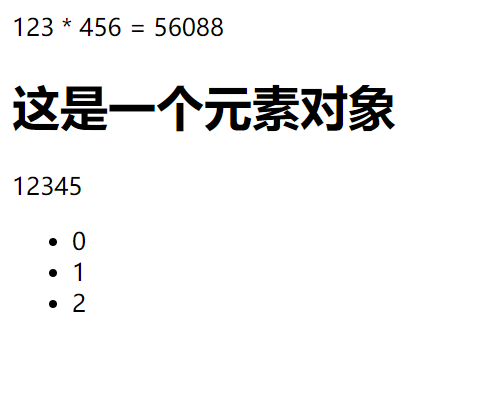

> 官网：https://react.docschina.org/

# 起步

## React简介

### 什么是React?

​	react是由Facebook研发的、用于解决UI复杂度的开源**JavaScript库**，目前由React联合社区维护。

> 它不是框架，只是为了解决UI复杂度而诞生的一个库

### React的特点

- **轻量**：React的开发版本所有源码（包含注释）仅3000多行
- **原生**：所有的React的代码都是用原生JS书写而成的，不依赖其他任何库
- **易扩展**：React对代码的封装程度较低，也没有过多的使用魔法，所以React中的很多功能都可以扩展
- **不依赖宿主环境**：React只依赖原生JS语言，不依赖任何其他东西，包括运行环境。因此，它可以被轻松的移植到浏览器、桌面应用、移动端
- **渐进式**：React并非框架，对整个工程没有强制约束力。这对与那些已存在的工程，可以逐步的将其改造为React，而不需要全盘重写
- **单向数据流**：所有的数据自顶而下的流动
- **用JS代码声明界面**
- **组件化**

### 对比Vue

|   对比项   | Vue  | React |
| :--------: | :--: | :---: |
| 全球使用量 |      |   √   |
| 国内使用量 |  √   |       |
|    性能    |  √   |   √   |
|   易上手   |  √   |       |
|   灵活度   |      |   √   |
|  大型企业  |      |   √   |
|  中型企业  |  √   |       |
|    生态    |      |   √   |

### 学习路径

> 整体原则：熟悉API --> 深入理解原理

1. React
   - 基础：掌握React的基本使用方法，有能力制作各种组件，并理解其基本运作原理
   - 进阶：掌握React中的一些黑科技，提高代码质量

2. React-Router：相当于vue-router
3. Redux：相当于Vuex
   - Redux本身
   - 各种中间件

4. 第三方脚手架：umi
5. UI库：Ant Design，相当于Vue的Element-UI 或 IView
6. 源码部分
   - React源码分析
   - Redux源码分析

## Hello World

> ### 直接在页面上使用React，引入下面的JS

~~~html
<!-- React的核心库，与宿主环境无关 -->

<!-- 依赖核心库，将核心库的功能与页面结合 -->

~~~

==说明：==crossorigin用于跨域访问报错时显示更详细的错误信息

### 创建React元素

1. **React.createElement**，用于创建一个React元素，称作虚拟DOM，本质上是一个对象

   - 参数1：元素类型，如果是字符串，一个普通的HTML元素
   - 参数2：元素的属性，一个对象
   - 后续参数：元素的子节点

   ~~~html
   
   ~~~

2. **JSX**

   JS扩展语法，需要使用babel进行转义

   ~~~html
   
   ~~~

   

## 使用脚手架

- 官方：create-react-app
- 第三方：next.js、umijs

==注意：==凡是使用JSX的文件，必须导入React

> 命令

~~~powershell
yarn create react-app 工程名
~~~

> package.json

~~~json
{
  "name": "react-learn",
  "version": "0.1.0",
  "private": true,
  "dependencies": {	// 依赖项
    "@testing-library/jest-dom": "^5.14.1",
    "@testing-library/react": "^13.0.0",
    "@testing-library/user-event": "^13.2.1",
    "react": "^18.2.0",
    "react-dom": "^18.2.0",
    "react-scripts": "5.0.1",
    "web-vitals": "^2.1.0"
  },
  "scripts": { // 运行脚本
    "start": "react-scripts start",	// 启动
    "build": "react-scripts build",	// 部署
    "test": "react-scripts test",		// 测试
    "eject": "react-scripts eject"	// 反编译
  },
  "eslintConfig": {	// 代码风格检查
    "extends": [
      "react-app",
      "react-app/jest"
    ]
  },
  "browserslist": {
    "production": [
      ">0.2%",
      "not dead",
      "not op_mini all"
    ],
    "development": [
      "last 1 chrome version",
      "last 1 firefox version",
      "last 1 safari version"
    ]
  }
}
~~~

## 开发环境

### VSCode配置

> emmet配置

- 点击左下角"设置"
- 搜索emmet
- 设置如下属性

~~~json
"emmet.triggerExpansionOnTab": true
~~~

### VSCode插件安装

- ESLint：代码风格检查
- ES7 React/Redux/GraphQL/React-Native snippets：快速代码编写

### Chrome插件安装

> React Developer Tools

# Reacth核心概念

## JSX

### 什么是JSX

- Facebook起草的JS扩展语法
- 本质是一个JS对象，会被babel编译，最终会被转换为React.createElement
- 每个JSX表达式，有且仅有一个根节点
  - React.Fragment(<></>)
- 每个JSX元素必须有结束标签（XML规范）

~~~js
import React from 'react';
import ReactDOM from 'react-dom';

const h1 = (
    <React.Fragment>
        <h1>Hello World span元素</h1>
        
p元素

    </React.Fragment>
)

ReactDOM.render(h1, document.getElementById('root'));
~~~

### 在JSX中嵌入表达式

- 将表达式作为内容的一部分
  - null、undefined和false不会显示
- 将表达式作为元素属性
- 属性使用小驼峰命名法
- 防止注入攻击
  - 自动编码
  - dangerouslySetInnerHTML

~~~js
import React from 'react';
import ReactDOM from 'react-dom';

const a = 123, b = 456;
const obj = { a: 1, b: 2 };
const objReact = <h1>这是一个元素对象</h1>;
const arr = [1, 2, 3, 4, 5];
const lis = new Array(3).fill(0).map((item, i) => (<li key={i}>{i}</li>))

const div = (
    

        {a} * {b} = {a * b}
        

            {/* 以下不会产生任何输出 */}
            {null}
            {undefined}
            {false}
        

        {/* 普通对象无法防止 */}
        {/* 
{obj}
 */} 
        {/* React元素对象可以放置 */}
        
{objReact}

        
{arr}

        <ul>{lis}</ul>
    

)

ReactDOM.render(div, document.getElementById('root'));
~~~

==示例：==

### 元素的不可变性

- 虽然JSX元素是一个对象，但是该对象中的所有属性不可更改
- 如果确定需要更改元素的属性，需要重新创建JSX元素

## [demo]图片切换

> index.js

~~~js
import React from 'react';
import ReactDOM from 'react-dom';
import src1 from "./assets/1.png";
import src2 from "./assets/2.png";
import src3 from "./assets/3.png";
import "./index.css";

const container = document.getElementById('root');
const srcs = [src1, src2, src3]; // 保存图片路径的数组
let index = 1; // 显示图片的索引
let timer;

/**
 * 根据index的值，显示对应的图片
 */
function render() {
    ReactDOM.render(, container);
}

/**
 * 启动计时器，每隔一段时间切换图片
 */
function start() {
    stop();
    timer = setInterval(() => {
        index = (index + 1) % 3; // 改变index
        render();
    }, 2000)
}

/**
 * 停止计时器
 */
function stop() {
    clearInterval(timer);
}

container.onmouseenter = () => {
    stop();
}
container.onmouseleave = () => {
    start();
}

render();
start();
~~~

> index.css

~~~css
#root {
    width: 520px;
    height: 280px;
    border: 2px solid;
    margin: 0 auto;
}

#root img {
    width: 100%;
    height: 100%;
    display: block;
}
~~~

## 组件与组件属性

**组件：**包含内容、样式和功能的UI单元

### 创建组件

==特别注意：组件的名称首字母必须大写==

1. 函数组件

   返回一个React元素

   > MyFuncComp.js

   ~~~js
   import React from 'react';
   
   export default function MyFuncComp() {
       return <h1>这是函数组件</h1>
   }
   ~~~

2. 类组件

   必须继承React.Component

   必须提供render函数，用于渲染组件

   > MyClassComp.js

   ~~~js
   import React, { Component } from 'react'
   
   export default class MyClassComp extends Component {
     render() {
       return <h1>这是类组件</h1>
     }
   }
   ~~~

### 组件的属性

> index.js

~~~js
import React from 'react';
import ReactDOM from 'react-dom';
import MyFuncComp from './MyFuncComp';
import MyClassComp from './MyClassComp';

ReactDOM.render(

    <MyFuncComp number={3} />
    <MyClassComp number='3' />

, document.getElementById('root'));
~~~

1. 对于函数组件，属性会作为一个对象的属性，传递给函数的参数

   > MyFuncComp.js

   ~~~js
   import React from 'react';
   
   export default function MyFuncComp(props) {
       return <h1>这是函数组件，数字：{props.number}</h1>
   }
   ~~~

2. 对于类组件，属性会作为一个对象的属性，传递给构造函数的参数

   > MyClassComp.js

   ~~~js
   import React, { Component } from 'react'
   
   export default class MyClassComp extends Component {
       constructor(props) {
           super();
       }
       
       render() {
           return <h1>这是类组件，数字：{this.props.number}</h1>
       }
   }
   ~~~

​	==注意：组件的属性，应该使用小驼峰命名法。==**组件无法改变自身的属性，React元素本质上就是一个组件（内置组件）**

3. React中的哲学：数据属于谁，谁才有权利改变。**故而React中的数据是自顶向下流动的**

